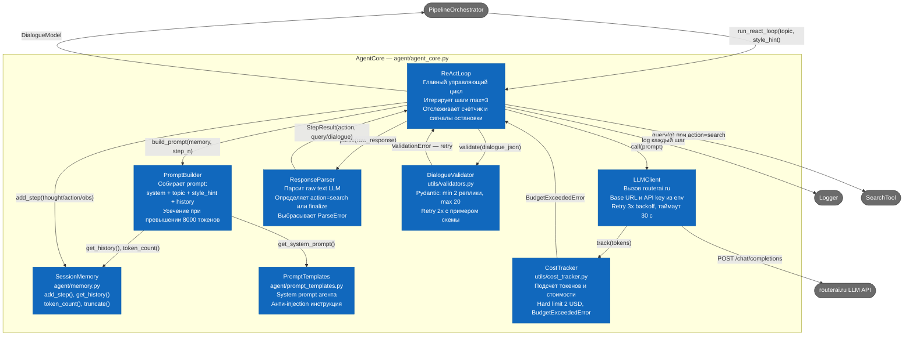

# C4 Level 3 — Component Diagram (AgentCore)

Показывает внутреннее устройство ядра системы — модуля `AgentCore`.  
Это наиболее сложный и критичный контейнер: всё взаимодействие с LLM происходит здесь.



## Критические пути в AgentCore

### Нормальный путь (1 итерация)
```
loop.step(1)
  → pb.build() [system + topic + empty history]
  → llm.call() → routerai.ru
  → rp.parse() → action=search, query="..."
  → search_tool.query()
  → mem.add_step(thought, action, observation)

loop.step(2)
  → pb.build() [system + topic + history(step1)]
  → llm.call() → routerai.ru
  → rp.parse() → action=finalize, dialogue_json={...}
  → val.validate() → OK
  → return DialogueModel
```

### Путь с ParseError
```
rp.parse() → ParseError
  → retry_count += 1
  → если retry_count ≤ 2:
      pb.add_correction_hint("Respond strictly in format: ...")
      → llm.call() снова
  → если retry_count > 2:
      force_finalize(mem.get_history())  ← генерирует диалог на базе имеющегося
```

### Путь с превышением бюджета
```
ct.track(tokens) → total_cost > $2.00
  → BudgetExceededError
  → loop.force_finalize() [без нового LLM-вызова на поиск]
  → val.validate() → ...
```

### Путь с исчерпанием итераций
```
loop.step(3) → action=search  ← агент всё ещё хочет искать
  → iteration_count = MAX (3)
  → force_finalize(mem.get_history())
  → val.validate() → ...
```
