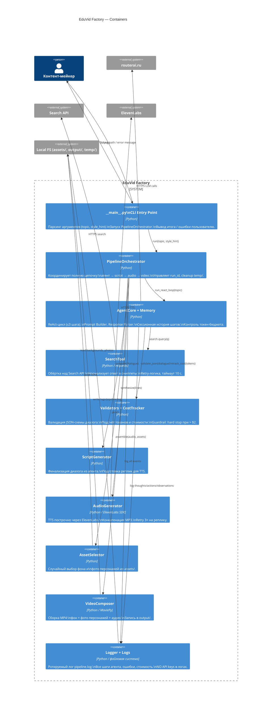

# C4 Level 2 — Container Diagram

Показывает внутренние контейнеры (исполняемые процессы / модули) и их взаимодействие.

## Ключевые потоки данных между контейнерами

1. **CLI → Orchestrator → AgentCore**: передаётся `topic` (строка) и опциональный `style_hint`
2. **AgentCore → SearchTool**: поисковый запрос (строка), возврат — список сниппетов
3. **AgentCore → routerai.ru**: полный prompt (system + history), возврат — structured text с `action` или `finalize + dialogue_json`
4. **AgentCore → Validators**: JSON строка диалога, возврат — `DialogueModel` или `ValidationError`
5. **Orchestrator → AudioGenerator**: список реплик `[{speaker, text}]`, возврат — путь к объединённому MP3
6. **Orchestrator → VideoComposer**: пути к аудио, фону и фото, возврат — путь к MP4
