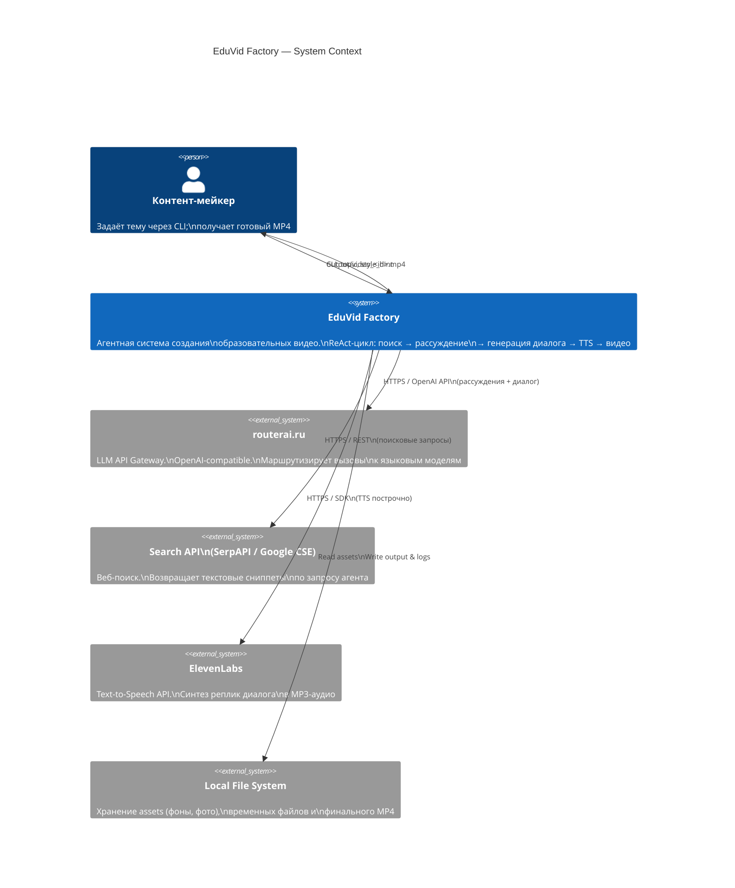

# C4 Level 1 — Context Diagram

Показывает систему целиком, её пользователей и внешние зависимости.

## Границы системы

| Внутри границы | Вне границы |
|---|---|
| ReAct-агент, pipeline синтеза, логика сборки видео | Языковые модели (routerai.ru) |
| Валидация диалога, управление состоянием | Поисковый индекс (Search API) |
| Логирование и cost-трекинг | Синтез речи (ElevenLabs) |
| | Публикация в соцсети (вне scope PoC) |
