# Data Flow Diagram

Показывает, как данные проходят через систему, что хранится, что логируется и что не должно попадать в лог.

```mermaid
flowchart LR
    subgraph INPUT["Входные данные"]
        U_TOPIC([topic: str\nstyle_hint: str optional])
    end

    subgraph AGENT_LAYER["Agent Layer"]
        SYS_PROMPT["system_prompt\n(из prompt_templates.py)\n⚠ содержит anti-injection инструкцию"]
        PROMPT_FULL["Full Prompt\nsystem + topic + style_hint\n+ history XML\n≤ 8 000 токенов"]
        LLM_RESP["LLM Response\n(raw text)\naction=search / finalize\n+ query или dialogue_json"]
        SEARCH_Q["Search Query\n(plain text, ≤ 100 символов)"]
        SEARCH_SNIPPETS["Search Snippets\n(title + snippet × N)\n⚠ untrusted — изолировать в [observation]"]
        DIALOGUE_JSON["Dialogue JSON\n{lines: [{speaker, text}]}\nvalidated by Pydantic"]
    end

    subgraph TTS_LAYER["TTS Layer"]
        REPLICS["Реплики\n[{speaker: str, text: str}]"]
        MP3_FILES["temp/<run_id>/line_N.mp3\n(временные, удаляются)"]
        MP3_CONCAT["temp/<run_id>/audio.mp3\n(финальный аудио)"]
    end

    subgraph ASSETS_LAYER["Assets Layer"]
        BG_VIDEO["assets/backgrounds/*.mp4\n(локальные файлы)"]
        CHAR_PHOTOS["assets/characters/*.jpg\n(локальные файлы)"]
    end

    subgraph OUTPUT_LAYER["Выходные данные"]
        FINAL_MP4["output/video_<run_id>.mp4\n(финальный видеофайл)"]
    end

    subgraph LOGGING["Логирование (logs/pipeline.log)"]
        L1["✅ Логируется:\n- topic, run_id\n- каждый thought/action\n- search query\n- observation (сниппеты)\n- токены, стоимость шага\n- ошибки и retry-события\n- путь к output файлу"]
        L2["🚫 НЕ логируется:\n- API ключи\n- полные промпты с системным промптом\n- сырые HTTP-заголовки авторизации\n- персональные данные"]
    end

    U_TOPIC --> SYS_PROMPT
    U_TOPIC --> PROMPT_FULL
    SYS_PROMPT --> PROMPT_FULL

    PROMPT_FULL -->|"HTTPS POST\nrouterai.ru"| LLM_RESP
    LLM_RESP -->|"action=search"| SEARCH_Q
    SEARCH_Q -->|"HTTPS\nSearch API"| SEARCH_SNIPPETS
    SEARCH_SNIPPETS -->|"isolated in [observation]"| PROMPT_FULL

    LLM_RESP -->|"action=finalize"| DIALOGUE_JSON
    DIALOGUE_JSON --> REPLICS

    REPLICS -->|"HTTPS\nElevenLabs"| MP3_FILES
    MP3_FILES --> MP3_CONCAT

    BG_VIDEO --> FINAL_MP4
    CHAR_PHOTOS --> FINAL_MP4
    MP3_CONCAT --> FINAL_MP4

    PROMPT_FULL -.->|"log: query, step_n"| L1
    LLM_RESP -.->|"log: action type, tokens"| L1
    SEARCH_SNIPPETS -.->|"log: snippets"| L1
    FINAL_MP4 -.->|"log: output path"| L1
```



## Что хранится и как долго

| Данные | Место | TTL |
|---|---|---|
| `topic`, `style_hint` | Только в памяти процесса | Время сессии |
| История шагов (thoughts, actions, observations) | `SessionMemory` (RAM) | Время сессии |
| Full prompt | Не хранится, только логируется частично | — |
| LLM raw response | Не хранится, парсится и отбрасывается | — |
| Dialogue JSON | `DialogueModel` (RAM) | До создания MP4 |
| `line_N.mp3` | `temp/<run_id>/` | До конца сессии, затем удаляется |
| `audio.mp3` | `temp/<run_id>/` | До конца сессии, затем удаляется |
| `video_<id>.mp4` | `output/` | Постоянно (пользователь удаляет вручную) |
| `pipeline.log` | `logs/` | Ротация: 10 МБ, 5 backups |

## Граница доверия к данным

```
TRUSTED        │  UNTRUSTED
───────────────┼──────────────────────────────
system_prompt  │  search snippets  ← могут содержать prompt injection
topic (user)   │  LLM response raw ← может нарушить формат
assets/        │  ElevenLabs audio ← проверять размер файла > 0
```

Данные из `UNTRUSTED` зоны обрабатываются через явные парсеры и валидаторы и **никогда** не встраиваются напрямую в system prompt.
